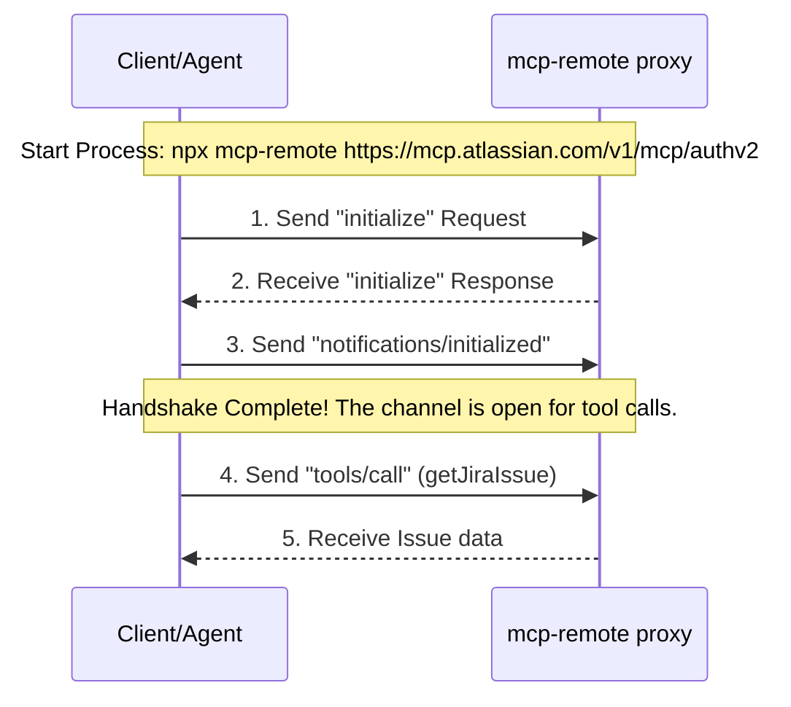

# 🧭 Atlassian MCP Integration & Pitfall-Free Setup Guide

This guide contains the precise, step-by-step procedure to connect to the Atlassian MCP Server **from absolute scratch**, designed specifically for developers and agents to avoid common trapdoors and connect successfully on the first attempt.

> [!WARNING]  
> **Jira is a Single-Page App (SPA).** Attempting to fetch or scrape Jira issue pages (e.g., `https://massapp.atlassian.net/browse/SCRUM-5`) using standard HTTP clients or curl will only return the empty bootstrap HTML (`<div id="jira-frontend"></div>`) because the content is rendered dynamically via client-side JavaScript. **You must use the MCP server or the Jira REST API to read issue details.**

---

## 🚫 5 Common Pitfalls & How to Avoid Them

| Pitfall                           | Symptoms                                                             | Root Cause                                                                                    | Solution                                                                                     |
| :-------------------------------- | :------------------------------------------------------------------- | :-------------------------------------------------------------------------------------------- | :------------------------------------------------------------------------------------------- |
| **1. Invalid npm Package**        | `npm error 404 Not Found - @atlassian/mcp-remote`                    | Using the incorrect package name `@atlassian/mcp-remote` in config templates.                 | Always use the public npm package name **`mcp-remote`** directly.                            |
| **2. Missing Handshake**          | `Request must be an initialize request if no session ID is provided` | Attempting to call tools (`tools/list`, `tools/call`) immediately on connection.              | You **must** send the `initialize` request and wait for the response before invoking tools.  |
| **3. Domain vs Cloud ID**         | 404 or 400 bad request errors from the Atlassian API.                | Passing the domain name (`massapp.atlassian.net`) as the site parameter.                      | Resolve the domain to its internal UUID **`cloudId`** via the accessible-resources endpoint. |
| **4. Empty Ticket Body**          | `Description: None` or empty fields.                                 | Specifications/requirements are uploaded as file attachments rather than inline descriptions. | Query the `fields.attachment` array and fetch the attachment files directly.                 |
| **5. Subprocess Shell Execution** | `FileNotFoundError: [WinError 2]` on Windows                         | Running `npx` directly in a Python subprocess on Windows.                                     | Run with `shell=True` (or call `npx.cmd`) as npx is a script/batch file on Windows.          |

---

## 🛠️ Step-by-Step Connection Procedure (From Scratch)

### 📌 Step 1: Install & Authenticate the Proxy

Open an interactive terminal and execute the `mcp-remote` CLI tool:

```bash
npx -y mcp-remote https://mcp.atlassian.com/v1/mcp/authv2
```

**What happens here:**

1. This downloads and executes the authentic Atlassian-authorized `mcp-remote` proxy.
2. It opens your browser to Atlassian's secure OAuth consent screen.
3. Once you grant permissions, the proxy caches your tokens locally on your machine:
   - **Windows:** `C:\Users\<USERNAME>\.mcp-auth\mcp-remote-0.1.37\*_tokens.json`
   - **macOS/Linux:** `~/.mcp-auth/mcp-remote-0.1.37/*_tokens.json`
4. The local STDIO server is now authenticated and ready for background proxy calls.

---

### 📌 Step 2: Resolve Domain Name to Cloud ID

Atlassian MCP tools reference sites by their **Cloud ID (UUID)**. You must convert `massapp.atlassian.net` to its Cloud ID.

1. Read your cached access token from the JSON file in `~/.mcp-auth/`.
2. Make a GET request to Atlassian's accessible resources endpoint:
   - **Endpoint:** `https://api.atlassian.com/oauth/token/accessible-resources`
   - **Header:** `Authorization: Bearer <your_access_token>`

#### **Python script to automate Cloud ID lookup:**

```python
import json
import glob
import os
import urllib.request

# Find the credentials file
token_files = glob.glob(os.path.join(os.path.expanduser("~"), ".mcp-auth", "mcp-remote-*", "*_tokens.json"))
if not token_files:
    raise FileNotFoundError("Run npx mcp-remote first to authenticate.")

with open(token_files[0], "r", encoding="utf-8") as f:
    tokens = json.load(f)

req = urllib.request.Request(
    "https://api.atlassian.com/oauth/token/accessible-resources",
    headers={"Authorization": f"Bearer {tokens['access_token']}"}
)

with urllib.request.urlopen(req) as response:
    resources = json.loads(response.read().decode("utf-8"))
    for res in resources:
        print(f"URL: {res['url']} -> Cloud ID: {res['id']}")
```

**Resolved Cloud ID for `massapp.atlassian.net`:**

```text
f4e0a515-47ec-4f6c-a289-a7d7f52ead94
```

---

### 📌 Step 3: Connect via JSON-RPC Stdio Handshake

When scripting the agent or tool communication, you must pipe commands through standard input and output (`stdio`) using the JSON-RPC 2.0 protocol.

#### **Protocol Handshake Flow:**



#### **Exact JSON payloads to send to `stdin`:**

##### **1. Initialize Request**

```json
{
  "jsonrpc": "2.0",
  "id": 1,
  "method": "initialize",
  "params": {
    "protocolVersion": "2024-11-05",
    "capabilities": {},
    "clientInfo": { "name": "Agent", "version": "1.0" }
  }
}
```

_(Wait to read the response from `stdout` before sending the next line)_

##### **2. Initialized Notification**

```json
{ "jsonrpc": "2.0", "method": "notifications/initialized", "params": {} }
```

##### **3. getJiraIssue Call**

```json
{
  "jsonrpc": "2.0",
  "id": 2,
  "method": "tools/call",
  "params": {
    "name": "getJiraIssue",
    "arguments": {
      "cloudId": "f4e0a515-47ec-4f6c-a289-a7d7f52ead94",
      "issueIdOrKey": "SCRUM-5"
    }
  }
}
```

---

### 📌 Step 4: Extracting Specifications from Attachments

If the response returns `"description": null` or an empty body, check the `"attachment"` array inside the response JSON.

```json
"attachment": [
  {
    "filename": "restaurant_menu.md",
    "content": "https://api.atlassian.com/ex/jira/f4e0a515-47ec-4f6c-a289-a7d7f52ead94/rest/api/3/attachment/content/10000"
  }
]
```

To download the actual specifications file:

1. Make a standard GET request to the `content` URL.
2. Inject the cached access token in the request header:
   ```text
   Authorization: Bearer <your_access_token>
   ```
3. Write the response bytes directly to your local file (e.g. `restaurant_menu.md`).

---

## 🚀 Complete Automated Setup & Orchestration Tool

To avoid making these manual mistakes, we have provided an end-to-end Python Orchestrator script: **[`scripts/mcp_jira_orchestrator.py`](file:///C:/Users/USER/works/driver-backend/scripts/mcp_jira_orchestrator.py)**.

Simply run this script to execute the entire procedure:

```bash
rtk python scripts/mcp_jira_orchestrator.py
```

This script handles the token lookup, executes the handshake protocol correctly, fetches ticket `SCRUM-5`, identifies specifications in the attachments, and downloads them immediately.
