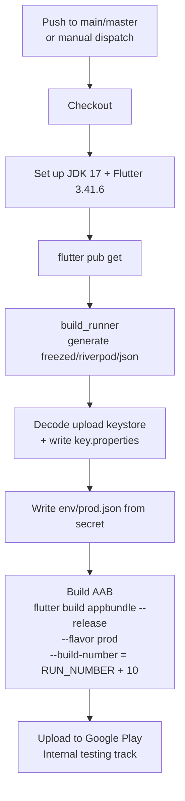

# customer_app

Mass Ride — Customer Flutter app.

Stack: Flutter · Riverpod · go_router · Firebase Messaging · Google Maps · Dio.
Code generation via `build_runner` (freezed / riverpod_generator / json_serializable).

## Getting Started (local dev)

```bash
# 1. Install dependencies
flutter pub get

# 2. Generate code (*.g.dart, *.freezed.dart) — these are gitignored,
#    so they MUST be regenerated on a fresh checkout before building.
dart run build_runner build --delete-conflicting-outputs

# 3. Run the app with the dev environment
flutter run --dart-define-from-file=env/dev.json
```

### Environments

Config is injected at build time with `--dart-define-from-file`:

| File                   | Usage                    | In git?               |
| ---------------------- | ------------------------ | --------------------- |
| `env/dev.json`         | Local / dev builds       | ✅ committed          |
| `env/prod.json`        | Production builds        | ❌ gitignored (secret) |
| `env/prod.json.example` | Template for prod config | ✅ committed          |

## CI/CD

### Overview

| Aspect      | Value                                                        |
| ----------- | ----------------------------------------------------------- |
| Workflow    | [`.github/workflows/deploy-preprod.yml`](.github/workflows/deploy-preprod.yml) |
| Platform    | **Android only** (iOS is not yet automated — see below)     |
| Output      | Release AAB → Google Play **Internal testing** track        |
| Package     | `com.massdrive.customer_app`                                |

### When does it run?

The pipeline triggers on **either**:

1. **Push** to `main` or `master` — every merge auto-deploys.
2. **Manual** — the "Run workflow" button on the GitHub **Actions** tab (`workflow_dispatch`).

A `concurrency` group (`deploy-preprod`, `cancel-in-progress: false`) ensures deploys
run one at a time and are never cancelled mid-upload.

### Pipeline flow



### Versioning

- **versionName** — comes from `pubspec.yaml`.
- **versionCode** — computed as `GITHUB_RUN_NUMBER + 10`, so it always increases
  without manual bumping. The `+10` offset clears versionCodes already consumed on
  Play by the old repo and the first manual upload (avoids "version code already used").

### Required GitHub Secrets

The workflow expects these repository secrets to be configured:

| Secret                     | Purpose                                              |
| -------------------------- | ---------------------------------------------------- |
| `KEYSTORE_BASE64`          | Base64-encoded Android upload keystore (`.jks`)      |
| `KEYSTORE_PASSWORD`        | Keystore password                                    |
| `KEY_PASSWORD`             | Key password                                         |
| `KEY_ALIAS`                | Key alias                                            |
| `PROD_ENV_JSON`            | Full contents of `env/prod.json`                     |
| `PLAY_SERVICE_ACCOUNT_JSON`| Google Play service-account JSON (for the upload API)|

### iOS → TestFlight

| Aspect   | Value                                                                    |
| -------- | ------------------------------------------------------------------------ |
| Workflow | [`.github/workflows/deploy-ios.yml`](.github/workflows/deploy-ios.yml)    |
| Runner   | `macos-15`                                                               |
| Signing  | [fastlane match](https://docs.fastlane.tools/actions/match/) (App Store) |
| Bundle id| `com.massdrive.customerApp` (Apple team `Q7742Z74Q3`)                    |
| Output   | Release build → **TestFlight**                                           |

> **Trigger is manual only** (`workflow_dispatch`) until the prerequisites below
> are in place. Uncomment the `push` block in the workflow to auto-deploy on merges
> to `main`.

**Pipeline:** checkout → Flutter + Ruby → `pub get` → `build_runner` → write
`env/prod.json` → `flutter build ios --config-only` (injects dart-defines +
`build number = run number + 10`) → `pod install` → `fastlane beta`
(match → manual signing → gym archive → `upload_to_testflight`).

**Prerequisites (one-time, manual — cannot be done from CI):**

1. Add the signing Apple account as a member of team `Q7742Z74Q3`.
2. Create the app record for `com.massdrive.customerApp` in App Store Connect.
3. Bootstrap a **private** match repo (run once by a team member with an
   Apple Distribution cert): `cd ios && bundle exec fastlane match appstore`.
4. Create an **App Store Connect API key** (Issuer ID, Key ID, `.p8`).
5. Generate `ios/Gemfile.lock` locally (`cd ios && bundle install`) and commit it
   for reproducible fastlane versions.

**Required GitHub Secrets (iOS):**

| Secret                          | Purpose                                                   |
| ------------------------------- | --------------------------------------------------------- |
| `MATCH_GIT_URL`                 | URL of the private match repo (certs/profiles)            |
| `MATCH_PASSWORD`                | Passphrase that decrypts the match repo                   |
| `MATCH_GIT_BASIC_AUTHORIZATION` | Base64 `user:token` to read the private match repo        |
| `ASC_KEY_ID`                    | App Store Connect API key id                              |
| `ASC_ISSUER_ID`                 | App Store Connect API issuer id                           |
| `ASC_KEY_P8_BASE64`             | Base64 of the API key `.p8` file                          |
| `PROD_ENV_JSON`                 | Contents of `env/prod.json` (shared with the Android job) |

**Local build** (archive without signing, just to verify it compiles):

```bash
flutter build ipa --no-codesign --dart-define-from-file=env/dev.json
```

> **Note:** iOS product flavors are not wired into the Xcode project yet
> (`ios/Flutter/Dev.xcconfig` / `Prod.xcconfig` exist but aren't attached to build
> configurations — see `ENV_SETUP.md`). The pipeline builds the plain `Runner`
> scheme in `Release`, so there is no `--flavor` flag on iOS.
