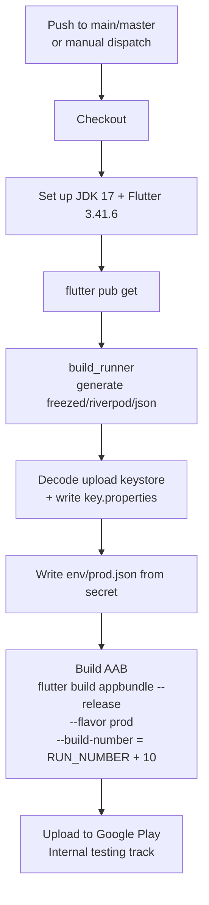

# customer_app

Mass Ride — Customer Flutter app.

Stack: Flutter · Riverpod · go_router · Firebase Messaging · Google Maps · Dio.
Code generation via `build_runner` (freezed / riverpod_generator / json_serializable).

## Getting Started (local dev)

```bash
# 1. Install dependencies
flutter pub get

# 2. Generate code (*.g.dart, *.freezed.dart) — these are gitignored,
#    so they MUST be regenerated on a fresh checkout before building.
dart run build_runner build --delete-conflicting-outputs

# 3. Run the app with the dev environment
flutter run --dart-define-from-file=env/dev.json
```

### Environments

Config is injected at build time with `--dart-define-from-file`:

| File                   | Usage                    | In git?               |
| ---------------------- | ------------------------ | --------------------- |
| `env/dev.json`         | Local / dev builds       | ✅ committed          |
| `env/prod.json`        | Production builds        | ❌ gitignored (secret) |
| `env/prod.json.example` | Template for prod config | ✅ committed          |

## CI/CD

### Overview

| Aspect      | Value                                                        |
| ----------- | ----------------------------------------------------------- |
| Workflow    | [`.github/workflows/deploy-preprod.yml`](.github/workflows/deploy-preprod.yml) |
| Platform    | **Android only** (iOS is not yet automated — see below)     |
| Output      | Release AAB → Google Play **Internal testing** track        |
| Package     | `com.massdrive.customer_app`                                |

### When does it run?

The pipeline triggers on **either**:

1. **Push** to `main` or `master` — every merge auto-deploys.
2. **Manual** — the "Run workflow" button on the GitHub **Actions** tab (`workflow_dispatch`).

A `concurrency` group (`deploy-preprod`, `cancel-in-progress: false`) ensures deploys
run one at a time and are never cancelled mid-upload.

### Pipeline flow



### Versioning

- **versionName** — comes from `pubspec.yaml`.
- **versionCode** — computed as `GITHUB_RUN_NUMBER + 10`, so it always increases
  without manual bumping. The `+10` offset clears versionCodes already consumed on
  Play by the old repo and the first manual upload (avoids "version code already used").

### Required GitHub Secrets

The workflow expects these repository secrets to be configured:

| Secret                     | Purpose                                              |
| -------------------------- | ---------------------------------------------------- |
| `KEYSTORE_BASE64`          | Base64-encoded Android upload keystore (`.jks`)      |
| `KEYSTORE_PASSWORD`        | Keystore password                                    |
| `KEY_PASSWORD`             | Key password                                         |
| `KEY_ALIAS`                | Key alias                                            |
| `PROD_ENV_JSON`            | Full contents of `env/prod.json`                     |
| `PLAY_SERVICE_ACCOUNT_JSON`| Google Play service-account JSON (for the upload API)|

### iOS (not yet in CI)

iOS is currently **built locally only** and is **not** part of the pipeline. Signing is
unresolved: the project is configured for Apple team `Q7742Z74Q3`
(`ios/Runner.xcodeproj`), and the bundle id `com.massdrive.customerApp` must be
registered to a team the build machine's Apple account belongs to.

Local build (archive without signing, to verify the build compiles):

```bash
flutter build ipa --no-codesign --dart-define-from-file=env/dev.json
```

To produce a signed IPA / ship to TestFlight, resolve signing first (join team
`Q7742Z74Q3`, or change the bundle id to one owned by your own team), then run
`flutter build ipa --dart-define-from-file=env/dev.json`.
